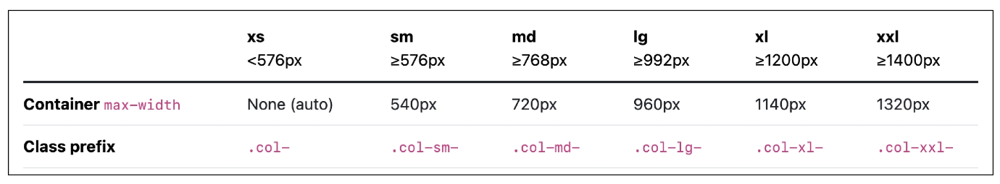

# Web
## Bootstrap

- CSS 프론트엔드 프레임워크(Toolkit)
- 미리 만들어진 다양한 디자인 요소들을 제공하여 웹 사이트를 빠르고 쉽게 개발할 수 있도록 함
- [bootstrap](https://getbootstrap.com/docs/5.3/getting-started/introduction/) 에서 CDN 링크(CSS, JS) 작성해주면 사용 가능 

#### CDN
- 지리적 제약 없이 빠르고 안전하게 콘텐츠를 전송할 수 있는 전송 기술
- 서버와 사용자 사이의 물리적인 거리를 줄여 콘텐츠 로딩에 소요되는 시간을 최소화
- 지리적으로 사용자와 가까운 CDN 서버에 콘텐츠를 저장해서 사용자에게 전달

### 사용가이드

**mt-5**
->property, sides - size


- 브라우저의 기본 폰트 사이즈 1rem(16px) 기준으로 상대 사이즈(rem) 설정되어있음

 - Bootstrap에는 특정한 규칙이 있는 클래스 이름으로 스타일 및 레이아웃이 미리 작성되어 있음

### Reset CSS
- 모든 HTML 요소 스타일을 일관된 기준으로 재설정하는 간결하고 압축된 규칙세트
> HTML Element, Table, List 등의 요소들에 일관성 있게 스타일을 적용 시키는 기본 단계

- 모든 브라우저는 각자의 'user agent stylesheet'를 가지고 있음 
    - 웹사이트를 보다 읽기 편하게 하기 위해
- 문제는 이 설정이 브라우저마다 상이하다는 것
- 모든 브라우저에서 웹사이트를 동일하게 보이게 만들어야 하는 개발자에겐 매우 골치아픈일
> 모두 똑같은 스타일 상태로 만들고 스타일 개발을 시작하기!

#### Normalize CSS
- Reset CSS 방법 중 대표적인 방법
- 웹 표준 기준으로 브라우저 중 하나가 불일치 한다면 차이가 있는 브라우저를 수정하는 방법
    - 경우에 따라 IE 또는 EDGE 브라우저는 표준에 따라 수정할 수 없는 경우도 있는데, 이 경우 IE 또는 EDGE의 스타일을 나머지 브라우저에 적용시킴

- bootstrp은 normalize.css 자체적으로 커스텀해서 사용하고 있음. 바로 리셋됨

### Bootstrap 활용
- 05-fundamentals-of-bootstraps 폴더에서 예시파일들 확인하기 

## Semantic Web
- 웹 데이터를 의미론적으로 구조화된 형태로 표현하는 방식
- 이요소가 시각적으로 어떻게 보여질까? -> 이 요소가 가진 목적과 역할은 무엇일까?

### HTML Semantic Element
- 기본적인 모양과 기능 이외에 의미를 가지는 HTML 요소
> 검색엔진 및 개발자과 웹 페이지 콘텐츠를 이해하기 쉽도록

- 대표적인 Semantic Element
    - header
    - nav
    - main
    - article
    - section
    - aside
    - footer
    > 위 요소들 div랑 기능 100% 같지만 웹 구성 구역 나타내기 위해서 사용함

    

### Semantic in CSS
#### CSS 방법론

CSS를 효율적이고 유지 보수가 용이하게 작성하기 위한 일련의 가이드라인

- OOCSS
    - 객체 지향적 접근법을 적용하여 CSS를 구성하는 방법론
    
    - 기본원칙
    1. 구조와 스킨을 분리
        

    2. 컨테이너와 콘텐츠를 분리
        - 객체에 직접 적용하는 대신 객체를 둘러싸는 컨테이너에 스타일을 적용
        - 스타일을 정의할 때 위치에 의존적인 스타일을 사용하지 않도록 함
        - 콘텐츠를 다른 컨테이너로 이동시키거나 재배치할때 스타일이 깨지는 것을 방지
        

## 참고

### Bootstrap을 사용하는 이유

- 가장 많이 사용되는 CSS 프레임워크
- 사전에 디자인된 다양한 컴포넌트 및 기능
    - 빠른 개발과 유지보수
- 손쉬운 반응형 웹 디자인 구현
- 커스터마이징이 용이
- 크로스 브라우징 지원
    - 모든 주요 브라우저에서 작동하도록 설계됨

### 의미론적인 마크업이 필요한 이유

- 검색엔진 최적화
    - 검색 엔진이 해당 웹 사이트를 분석하기 쉽게 만들어 검색 순위에 영향을 줌

- 웹 접근성
    - 웹 사이트, 도구, 기술이 고령자나 장애를 가진 사용자들이 사용할 수 있도록 설계 및 개발하는 것
    - ex) 스크린 리더를 통해 전맹 시각장애 사용자에게 웹의 글씨를 읽어줌

## Responsive Web
### Bootstrap Grid system

- 웹 페이지의 레이아웃을 조정하는데 사용되는 12개의 컬럼으로 구성된 시스템
- 반응형 디자인을 지원해 웹 페이지를 모바일, 태블릿, 데스크탑 등 다양한 기기에서 적절하게 표시할 수 있도록 도움

#### 반응형 웹 디자인

- 디바이스 종류나 화면 크기에 상관없이, 어디서든 일관된 레이아웃 및 사용자 경험을 제공하는 디자인 기술

#### Grid system 구조

- Grid system 기본 요소
1. container
    - column들을 담고 있는 공간
2. column
    - 실제 컨텐츠를 표함하는 부분
3. Gutter
    - 컬럼과 컬럼 사이의 여백 영역

```html

<div class = "container">
    <div class = "row">
        <div class = "col-4"></div>
        <div class = "col-4"></div>
        <div class = "col-4"></div>
    </div>
</div>

<!-- 이런식으로 나타냄 -->
```

### Grid system for responsive web

#### Responsive Web Design

- 디바이스 종류나 화면 크기에 상관없이, 어디서든 일관된 레이아웃 및 사용자 경험을 제공하는 디자인 기술
- Bootstrap grid system에서는 12개 column과 6개 breakpoints를 사용하여 반응형 웹 디자인을 구현

#### Grid system breakpoints

- 웹페이지를 다양한 화면 크기에서 적절하게 배치하기 위한 분기점
> 화면 너비에 따라 6개의 분기점 제공 (xs, sm, md, lg, xl, xxl)


- 각 breakpoints 마다 설정된 최대 너비 값 **"이상으로"** 화면이 커지면 grid system 동작이 변경됨

