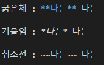

# 7월 11일 학습 정리

## 1. 마크다운
### 리스트
#### <순서있는 리스트>

    1. 과일
        1. 딸기
        2. 포도
    2. 생선
        1. 고등어 
        2. 갈치

@참고@ shift + tab 상위 탭로 이동

#### <순서없는 리스트>
    - 우산
    - 의류
        - 셔츠
        - 바지
---
### 코드블락


출력화면 :

```python
print('hello')
print("world")
```


### 인라인코드


출력화면 :

파이썬은 `print` 함수를 사용한다.

---
### 링크 첨부


출력화면 : 

[구글](https://www.google.com)

[Naver](https://www.naver.com)


@참고@ 이미지의 너비와 높이는 마크다운으로 조절할 수 없음 (HTML 사용필요)

---
### 텍스트 관련 문법



출력화면 :

굵은체 : **나는** 나는

기울임 : *나는* 나는

취소선 : ~~나는~~ 나는

### 수평선

"---" 사용

### 마크다운 에디터
 - Typora(유료) 
 - MarkText(무료) 
 - Markdown all in one(VS Code 설치)


## 2. CLI

### 문법 및 활용
- 현재 디렉토리
```cli
cd.
```
- 현재의 상위 디렉토리
```cli
cd..
```
- 디렉토리로 이동
```cli
cd 파일명/
```
- 파일 생성
```cli
touch 파일명.확장자
```
- 디렉토리 생성
```cli
mkdir 파일명.확장자
```
- 현재 작업중인 디렉토리 내부의 폴더/파일 목록 출력
```cli
ls
ls -a   # 숨김 폴더/파일 표시
```
- 폴더/파일 열기
```cli
start 파일명.확장자
```
- 파일 삭제
```cli
rm 파일명.확장자
rm -r 디렉토리명
```
- 코드로 열기
```cli
code 파일명.확장자
code . (현재 위치 코드로 열기)
```
- 절대 경로
```cli
pwd
```

## 3. GIT
### 버전관리
변화를 기록하고 추적하는 것
- 중앙 집중식: 버전은 중앙서버에 저장되고 중앙 서버에서 파일을 가져와 중앙에 업로드
- 분산식 : 버전을 여러 개의 복제된 저장소에 저장 및 관리

    → 작업 하기 전에 서버의 버전과 비교하여 항상 최신으로 업데이트 할 것
### git의 영역
- Working Directory

    실제 작업 중인 파일들이 위치하는 영역
- Staging Area
    
    워킹 디렉토리에서 변경된 파일 중 다음 버전에 포함시킬 파일들을 선택적으로 추가하거나 제외할 수 있는 중간 준비 영역
- Repository
    
    버전 이력과 파일들이 영구적으로 저장되는 영역
    모든 버전과 변경 이력이 기록됨
### git의 문자
- git init
    
    로컬 저장소 설정(초기화) 
    
    → git의 버전 관리를 시작할 디렉토리에서 진행
- git add
    
    변경사항이 있는 파일을 staging area에 추가
    
    파일, 폴더 관계없음
    ```cli
    git add a.txt, b.txt 
    git add *.txt 
    (txt 확장자 파일 전부 올리고 싶을 때)
    git add . 
    (디렉토리 내 모든 파일 전부 올리고 싶을 때)
    ```
- git commit

    staging area에 있는 파일들을 저장소에 기록
    
    변경이력 생성
    
    **주의!! git add를 통해 satging area에 꼭 올리기!**

    ```cli
    git commit -m “설정할 커밋 이름”
    ```
- git status

    현재 git이 커밋된 것이 있는지 현재 상태 출력해줌
- git rm —cached
    
    stage에 올라간 파일을 디렉토리로 이동하고 싶을 때

- git config --global
    레포지토리 같이 사용할 때
    ID 먼저 입력 해주고 commit 할 수 있음
    사용자 설정
    ```cli
    git config --global user.email "이메일 입력"
    git config --global user.name "닉네임 입력" 
    ```
- git log

    commit 목록 확인

    작성자, 날짜, 메세지 나옴
    
- git log --oneline 
    
    한줄로 각 커밋 정보 간략하게 보여줌
    
- HEAD 는 최신의 commit를 따라감
