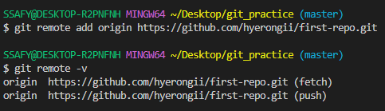
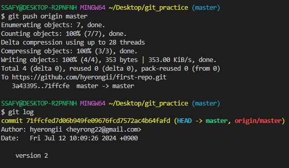

# 7월 12일 학습 정리

## Remote Repository (원격 저장소)

    코드와 버전 관리 이력을 온라인 상의 특정 위치에 저장하여 여러 개발자가 협업하고 코드를 공유할 수 있는 저장 공간

    ex) gitlab, github, bitbucket

### 1. 로컬 & 원격 저장소

#### - 로컬 저장소에 원격 저장소 추가
```cli
git remote add origin(닉네임) remote_repo_url(github 레포지토리 주소)
```

origin : 추가하는 원격 저장소 별칭

별칭을 사용해 로컬저장소에 여러개 연결할 수 있음

#### - 로컬 저장소에 원격 저장소 주소 등록

```cli
git remote add origin(다른이름이어도 상관 없음) 레포지토리 주소

잘 연결 되어 있는지 확인 
git remote -v 
```


#### - push / pull & clone
- push

```cli
git push origin master
```
원격 저장소에 commit 목록을 업로드

git 아 origin이라는 이름의 원격 저장소에 master branch를 push해줘

!! 주의 !! 
파일 수정 후 저장후 커밋찍고 push 할 것



local에 있는 branch인 master, 원격에 있는 branch인 origin/master 의 가장 최신 commit은 HEAD

#### !!원격 저장소에는 commit이 올라가는 것!!

- pull & clone
```cli
git pull origin master
```
원격 저장소의 변경사항만을 받아옴(업데이트)

```cli
git clone remote_repo_url
```
원격 저장소 전체를 복제(다운로드)

!! branch 표시 없을 때 깃 클론 할 수 있다.

!! 이미 git init 되어있다.

- 파일명 cli로 변경하고 싶을 때
```cli
mv -f 변경하고싶은파일명 변경할파일명
```

부울경


## Git revet & reset